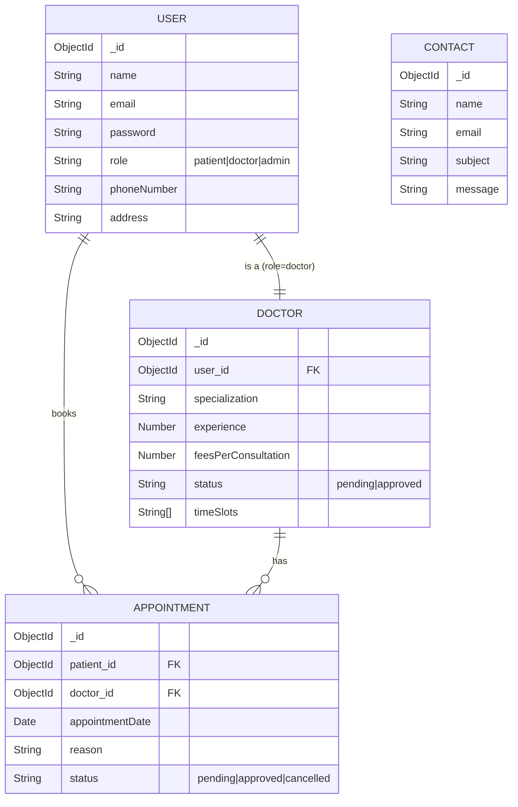

# Database Schema & Design

## 📊 ER Diagram

## 🗃️ Schema Details

### Users Collection

| Field         | Type     | Description                            |
| :------------ | :------- | :------------------------------------- |
| `_id`         | ObjectId | Unique Identifier                      |
| `name`        | String   | Full Name                              |
| `email`       | String   | Unique Email Address                   |
| `password`    | String   | Hashed Password                        |
| `role`        | String   | `patient` (default), `doctor`, `admin` |
| `phoneNumber` | String   | Contact Number                         |
| `address`     | String   | Physical Address                       |

### Doctors Collection

| Field            | Type     | Description                        |
| :--------------- | :------- | :--------------------------------- |
| `user`           | ObjectId | Reference to `User` model          |
| `specialization` | String   | Medical Specialization             |
| `experience`     | Number   | Years of Experience                |
| `feesPerCnslt`   | Number   | Consultation Fee                   |
| `status`         | String   | `pending`, `approved`, `cancelled` |
| `timings`        | Object   | Start and End times                |

### Appointments Collection

| Field             | Type     | Description                                  |
| :---------------- | :------- | :------------------------------------------- |
| `patient`         | ObjectId | Reference to User (Patient)                  |
| `doctor`          | ObjectId | Reference to Doctor                          |
| `appointmentDate` | Date     | Scheduled Date/Time                          |
| `status`          | String   | `pending` (default), `approved`, `cancelled` |
| `reason`          | String   | Reason for visit                             |

### Contact Collection

| Field     | Type   | Description     |
| :-------- | :----- | :-------------- |
| `name`    | String | Sender Name     |
| `email`   | String | Sender Email    |
| `subject` | String | Message Subject |
| `message` | String | Message Content |
